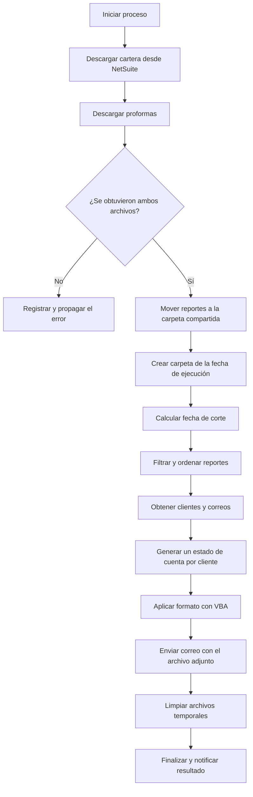

# Descripción funcional

[Volver a la documentación principal](../README.md)

## Objetivo del robot

El robot busca automatizar la circularización de cartera: descarga desde NetSuite los reportes necesarios, filtra la información por cliente, genera un archivo de estado de cuenta usando una plantilla de Excel y envía el resultado por correo.

## Estado de implementación observado

El archivo `Main.xaml` contiene dos niveles distintos de comportamiento:

1. **Flujo activo:** descarga los reportes de cartera y proformas, los mueve a la carpeta compartida, crea la carpeta correspondiente a la ejecución y calcula la fecha de corte.
2. **Flujo previsto, actualmente deshabilitado:** filtra y transforma los reportes, consulta los datos de clientes, genera un Excel individual, aplica formato VBA, envía correos y marca la ejecución como terminada.

El segundo nivel está dentro de `Comment Out`, por lo que UiPath no lo ejecuta. Como la asignación `isFinish = True` también está deshabilitada, el `Retry Scope` exterior termina reintentando y finalmente reporta `Error en el flujo`.

## Flujo funcional previsto

## Entradas

- Sesión válida de NetSuite disponible en Chrome.
- Reporte de cartera, búsqueda guardada `searchid=2010`.
- Reporte de correos de clientes, búsqueda guardada `searchid=2011`.
- Reporte de proformas, Suitelet `script=496&deploy=1`.
- Plantilla `PLANTILLA ESTADO DE CUENTA SM.xlsx`.
- Activo de Orchestrator `Ruta VBA limpieza plantilla`.
- Acceso de lectura y escritura a la carpeta compartida.
- Conexión de Microsoft 365 para el buzón de cartera.

## Transformaciones previstas

- Conserva documentos con saldo pendiente mayor que cero.
- Ordena registros por cliente o tercero, según el reporte.
- Obtiene nombre, NIT y correo del cliente.
- Agrupa facturas y proformas por cliente.
- Copia la plantilla y escribe los datos desde la fila 8.
- Aplica la macro `FormatStatementReport("ESTADO CUENTA")`.
- Adjunta el archivo generado al correo del cliente.

## Salidas

- Reportes descargados y almacenados en la carpeta base.
- Carpeta por fecha de ejecución bajo `cliente`.
- Un archivo `.xlsx` por cliente, cuando el flujo completo esté habilitado.
- Correos enviados y notificación final, cuando el flujo completo esté habilitado y los destinatarios hayan sido validados.

## Reglas y decisiones relevantes

- El proceso reintenta hasta tres veces, con intervalos de 30 segundos.
- La descarga de proformas tiene un reintento adicional para comprobar la existencia del archivo.
- Los nombres de cliente se limpian de caracteres no permitidos en nombres de archivo.
- La carpeta de la fecha actual puede eliminarse y recrearse; esto exige validar previamente su alcance.
- El proyecto mata procesos `EXCEL` durante algunas fases, lo que puede afectar sesiones ajenas en la misma máquina.

